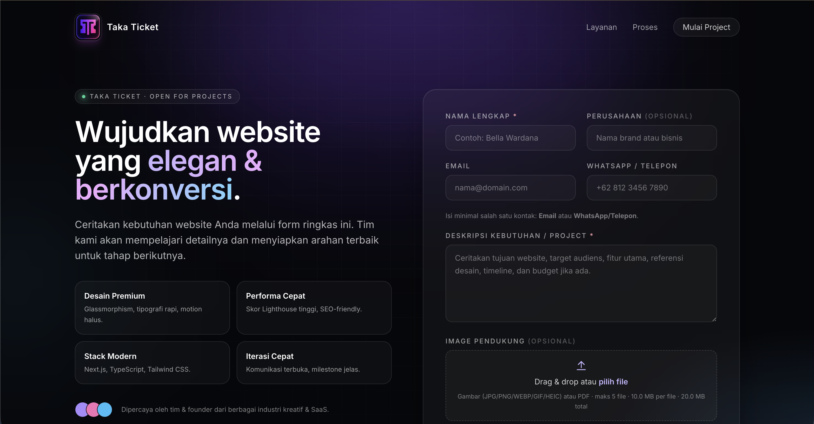

# Taka Ticket — Landing Page & Sistem Tiket Request Pembuatan Website



Proyek **Next.js (App Router) + TypeScript** untuk landing page agency dan
sistem tiket request pembuatan website. Form mengirim email otomatis melalui
**Nodemailer** ke alamat yang sudah dikonfigurasi.

## Tech Stack

- [Next.js 14 (App Router)](https://nextjs.org/) + TypeScript
- [Tailwind CSS](https://tailwindcss.com/) — styling, glassmorphism, palet gelap monokrom
- [React Hook Form](https://react-hook-form.com/) + [Zod](https://zod.dev/) — form & validasi
- [Framer Motion](https://www.framer.com/motion/) — animasi transisi
- [Nodemailer](https://nodemailer.com/) — pengiriman email via SMTP
- [react-hot-toast](https://react-hot-toast.com/) — toast notification

## Struktur Folder

```
taka-ticket/
├─ public/
├─ src/
│  ├─ app/
│  │  ├─ actions/
│  │  │  └─ submit-request.ts        # Server Action untuk submit form
│  │  ├─ api/
│  │  │  └─ contact/
│  │  │     └─ route.ts              # API Route alternatif (POST JSON)
│  │  ├─ globals.css                 # Tailwind layers + komponen utility
│  │  ├─ layout.tsx                  # Root layout (font Inter + Toaster)
│  │  └─ page.tsx                    # Halaman utama (hero + form, split-screen)
│  ├─ components/
│  │  ├─ Hero.tsx                    # Hero section profesional + animasi
│  │  └─ RequestForm.tsx             # Form RHF + Zod + Framer Motion
│  └─ lib/
│     ├─ email-template.ts           # HTML & text email template
│     ├─ mailer.ts                   # Konfigurasi transporter Nodemailer
│     └─ schema.ts                   # Zod schema (validasi termasuk
│                                    # "minimal salah satu Email/Telepon")
├─ .env.example
├─ .env.local                        # placeholder — isi MAIL_PASSWORD
├─ .eslintrc.json
├─ .gitignore
├─ next.config.mjs
├─ next-env.d.ts
├─ package.json
├─ postcss.config.mjs
├─ tailwind.config.ts
└─ tsconfig.json
```

## Setup

```bash
# 1. Install dependencies
npm install

# 2. Salin / sesuaikan environment variables
cp .env.example .env.local
# Lalu edit .env.local dan isi MAIL_PASSWORD dengan App Password Gmail.

# 3. Jalankan dev server
npm run dev
```

Buka [http://localhost:3000](http://localhost:3000).

## Konfigurasi SMTP (.env.local)

> **Penting:** Untuk Gmail, `MAIL_PASSWORD` harus berupa
> [Google App Password](https://myaccount.google.com/apppasswords)
> (16 karakter, bukan password akun biasa). Aktifkan 2-Step Verification
> terlebih dahulu.

```env
MAIL_MAILER=smtp
MAIL_HOST=smtp.gmail.com
MAIL_PORT=587
MAIL_USERNAME=apsonemailserver@gmail.com
MAIL_PASSWORD=APP_PASSWORD_16_KARAKTER
MAIL_ENCRYPTION=tls
MAIL_FROM_ADDRESS=apsonemailserver@gmail.com
MAIL_FROM_NAME="Taka Ticket"

MAIL_TO_ADDRESS=umarmarufmutaqin@gmail.com
```

> Catatan: `MAIL_USERNAME` / `MAIL_FROM_ADDRESS` masih menggunakan akun
> `apsonemailserver@gmail.com` sesuai konfigurasi SMTP yang sudah ada. Hanya
> `MAIL_FROM_NAME` ("Taka Ticket") yang menentukan nama pengirim yang muncul
> di inbox penerima.

## Spesifikasi Form & Validasi

- **Nama Lengkap** — wajib, 2–100 karakter.
- **Deskripsi Kebutuhan / Project** — wajib, textarea 20–5000 karakter.
- **Email** — opsional, format email valid jika diisi.
- **WhatsApp / Telepon** — opsional, format telepon valid jika diisi.
- **Custom rule:** minimal salah satu antara Email atau WhatsApp/Telepon
  **wajib diisi**. Pesan error ramah ditampilkan di kedua field bila keduanya
  kosong (lihat `src/lib/schema.ts`).
- **Perusahaan** — opsional, ditampilkan di subject email jika diisi.
- **Image Pendukung (opsional)** — multi-file upload (drag & drop / picker).
  - Tipe yang diizinkan: gambar (JPG, PNG, WEBP, GIF, HEIC) atau PDF.
  - Maksimal 5 file per submit, 10 MB per file, 20 MB total.
  - File dikirim sebagai **attachment email** ke alamat tujuan.

## Alur Submit

1. User submit form → `RequestForm` memanggil **Server Action**
   `submitRequestAction` (`src/app/actions/submit-request.ts`).
2. Server Action memvalidasi ulang dengan Zod, kemudian membangun template
   email (`src/lib/email-template.ts`) dan mengirimnya via transporter
   Nodemailer (`src/lib/mailer.ts`).
3. Hasil dikembalikan ke client → toast notification sukses/gagal +
   tampilan "Permintaan Terkirim".

> Tersedia juga endpoint REST alternatif `POST /api/contact` jika kamu
> perlu memanggil dari klien lain (mobile app, dsb).

## Skrip

| Skrip            | Keterangan                          |
|------------------|-------------------------------------|
| `npm run dev`    | Jalankan dev server                 |
| `npm run build`  | Build production                    |
| `npm run start`  | Jalankan hasil build                |
| `npm run lint`   | Jalankan ESLint                     |

## Deployment

Cocok di-deploy ke **Vercel**. Pastikan environment variables `MAIL_*`
sudah dikonfigurasi di dashboard project. Karena Nodemailer butuh runtime
Node.js, route/action ini menggunakan `runtime = "nodejs"` (default untuk
Server Actions).

> **Catatan deployment lokal/VM:** beberapa lingkungan (sandbox, Docker,
> beberapa VM cloud) memblokir koneksi outbound ke port SMTP (25/465/587).
> Kalau submit-form gagal dengan error koneksi, verifikasi konektivitas:
> ```bash
> timeout 5 bash -c '</dev/tcp/smtp.gmail.com/587' && echo OK || echo BLOCKED
> ```
> Vercel & sebagian besar provider production tidak memblokir port ini.

---

Built with care by Taka Ticket.
# taka-ticket
